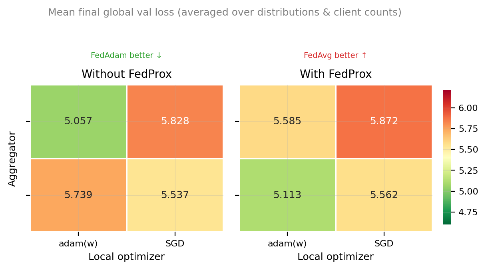
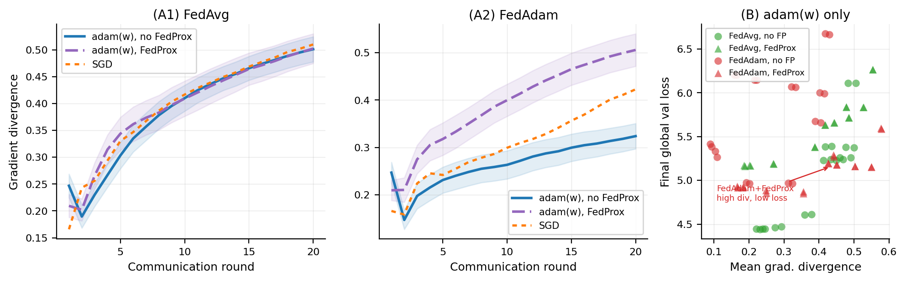
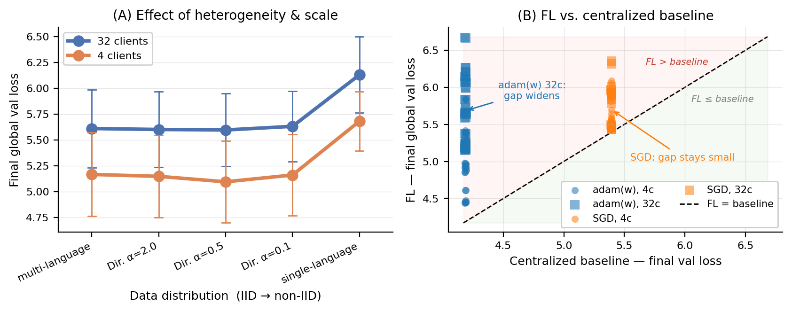

# Federated Learning for Multilingual Language Modeling

EPFL Optimization for Machine Learning.

We study how data heterogeneity, aggregation strategy, client regularization, and local optimizer interact in a federated language modeling setting. 120 experiments sweep all combinations across 4 languages (French, Spanish, Italian, Portuguese).

---

## Experiment Grid

| Axis                  | Values                                                          |
| --------------------- | --------------------------------------------------------------- |
| Clients               | 4, 32                                                           |
| Data distribution     | `multi_language`, `single_language`, `dirichlet(α=0.1/0.5/2.0)` |
| Aggregator            | `fedavg`, `fedadam`                                             |
| Client regularization | none, `fedprox`                                                 |
| Local optimizer       | `adamw`, `adam`, `sgd`                                          |

**Total: 2 × 5 × 2 × 2 × 3 = 120 experiments.**

Each experiment runs 20 FL rounds of 50 local steps per client and is compared against a centralized baseline trained with the same total compute budget.

---

## Model

A small GPT (~few M parameters) with modern architecture improvements:

- RoPE positional embeddings
- RMSNorm (pre-norm)
- Grouped Query Attention (GQA)
- Value Embeddings on alternating layers (ResFormer-style)
- ReLU² MLP activations
- Logit softcapping

Configured via `depth=8`, `aspect_ratio=64`, `head_dim=64` → model dim 512, 8 heads.

---

## Results

|                                                           |                                                                                                                    |
| --------------------------------------------------------- | ---------------------------------------------------------------------------------------------------------------    |
|  | **FedProx interaction** — heatmap of how FedProx regularization interacts with aggregator and optimizer choice.    |
|         | **Gradient divergence** — Impact of FedProx, local optimizer, and aggregator on gradient divergence, for 32 clients|
|       | **Heterogeneity vs. baseline gap** — Effect of heterogeneity and FL vs. centralized baseline                       |

The figures above, in `figs_paper/`, are generated by `notebooks/analysis_final.ipynb`.

---

## Setup

```bash
pip install -r requirements.txt
```

PyTorch is not pinned to a CUDA version in `requirements.txt`. Install the right wheel for your GPU:

```bash
# Example for CUDA 12.4
pip install torch --extra-index-url https://download.pytorch.org/whl/cu124
```

Optional: set `HF_TOKEN` for higher HuggingFace download rate limits.

---

## Running Experiments

```bash
# Run all 120 experiments (resumes automatically if interrupted)
python main.py

# Start fresh, overwriting existing results
python main.py --overwrite

# Run a single experiment by ID
python main.py --exp-id c4_multi_language_fedavg_none_adamw

# Generate comparison figures from completed results
python main.py --generate-graphs

# Enable Weights & Biases logging
python main.py --wandb --wandb-project optml-fedlearning

# Override FL hyperparameters
python main.py --num-rounds 10 --local-steps 100
```

Experiment IDs follow the pattern `c{clients}_{distribution}_{aggregator}_{regularization}_{optimizer}`, e.g. `c32_dirichlet0.1_fedadam_fedprox_sgd`.

Results are saved to `results/{exp_id}/history.json`. Per-experiment training curves are saved to `figs/`.

---

## Project Structure

```
main.py              — entry point; argument parsing, experiment loop
src/
  config.py          — dataclasses for all hyperparameters; grid generator
  model.py           — GPT model definition
  data.py            — download, tokenize, cache, and partition data
  training.py        — FL training loop and centralized baseline
  aggregation.py     — FedAvg and FedAdam server aggregators
  visualization.py   — per-experiment plots and final comparison figures
notebooks/
  analysis_final.ipynb     — figures used in the report
  analysis_experiments.ipynb
results/             — per-experiment JSON histories
figs/                — per-experiment training curves
figs_paper/          — final figures for the report
```

---

## Tracked Metrics

Each experiment records per round:

- Global validation loss
- Per-client local train and validation loss
- Per-client mean gradient norm (clipped, across local steps)
- Gradient divergence (1 − mean cosine similarity of each client's parameter update against the mean update)
- Cumulative communication cost (MB)
- Round wall-clock time

The centralized baseline records train/validation loss at equal compute steps.
